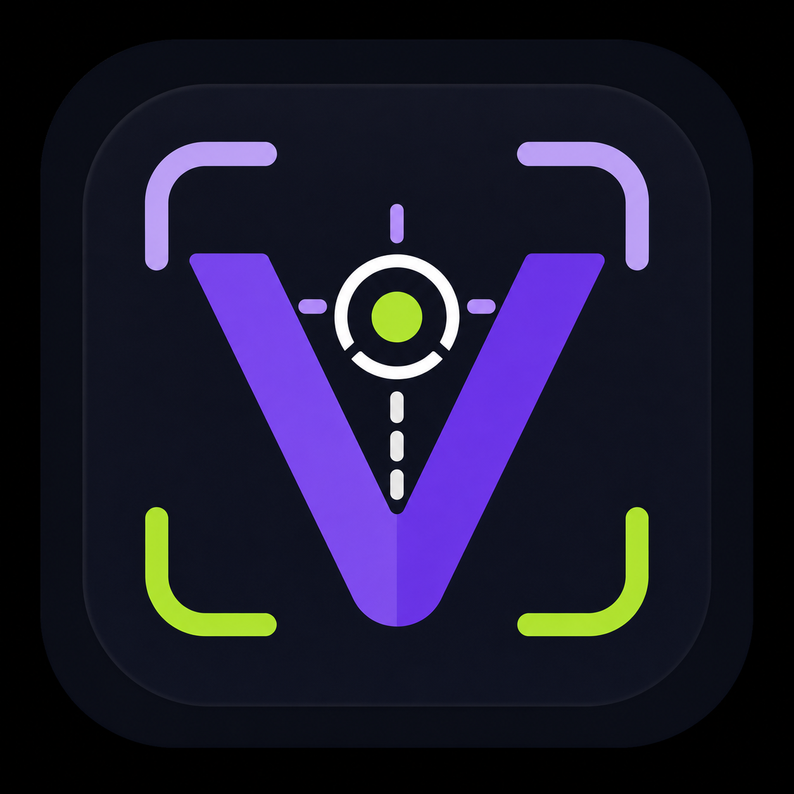
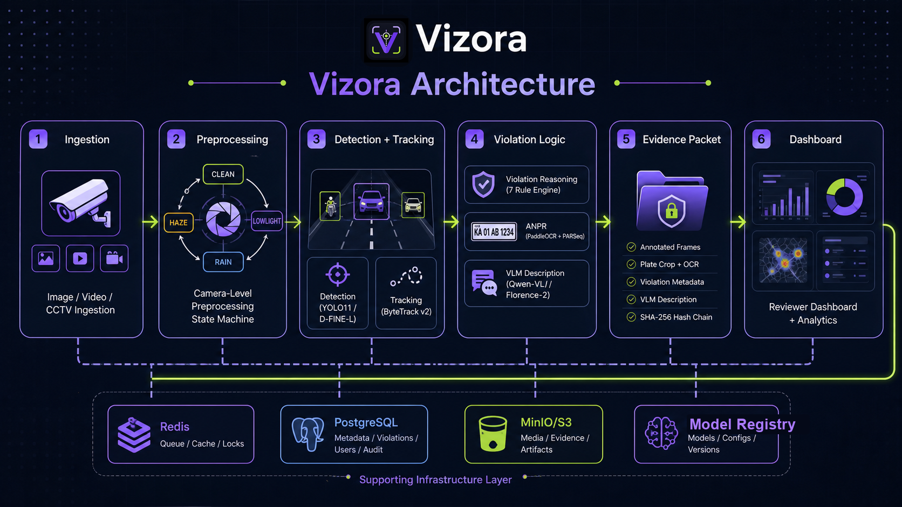

<div align="center">



# Vizora

### AI-Powered Traffic Violation Detection from Surveillance Imagery

**Flipkart Gridlock 2.0 Hackathon — Round 2**

Automated photo identification, classification, and evidence generation for traffic violations using computer vision.

**Prepared by:** Mohana Krishna  
**Contact:** [codexmohan@gmail.com](mailto:codexmohan@gmail.com)

<br />

<a href="https://github.com">
  
</a>
<a href="https://python.org">
  
</a>
<a href="https://nextjs.org">
  
</a>
<a href="https://fastapi.tiangolo.com">
  
</a>

<br />

<a href="https://pytorch.org">
  
</a>
<a href="https://www.ultralytics.com">
  
</a>
<a href="https://www.maplibre.org">
  
</a>
<a href="https://www.docker.com">
  
</a>
<a href="https://www.postgresql.org">
  
</a>
<a href="https://redis.io">
  
</a>
<a href="https://min.io">
  
</a>

</div>

---

## The Problem

India's traffic surveillance cameras generate millions of images daily. Manual review is slow, inconsistent, and cannot scale. Violations go unpunished, repeat offenders are unidentified, and enforcement is reactive rather than proactive.

Existing solutions are either:
- **Manual** — human reviewers looking at camera feeds (doesn't scale)
- **Single-purpose** — only detects one violation type (e.g., speed cameras)
- **Fragile** — breaks in rain, night, fog, or dense traffic

## Our Approach

Vizora is an end-to-end computer vision pipeline that takes raw traffic imagery and produces **court-admissible evidence packets** — automatically.



**What makes this different:**

- **7 violation types** in one pipeline — helmet, seatbelt, triple-ride, wrong-side, stop-line, red-light, illegal parking
- **Camera-level preprocessing state machine** — not per-frame flickering. A camera stays in CLEAN/LOWLIGHT/HAZE/RAIN mode consistently, so tracking never breaks
- **Configurable model profiles** — swap YOLO for RT-DETRv2 or D-FINE through config, not code changes
- **Tamper-evident evidence** — SHA-256 hash chain across frames + metadata
- **Privacy-first local inference** - core detection, OCR, VLM description, storage, and review are designed to run without external API providers
- **Privacy-by-design evidence handling** - face blur, plate redaction, plate hashing, local object storage, and DPDP Act compliance
- **Human-in-the-loop** — low-confidence violations route to a review queue, not auto-rejected

---

## Violation Types

| Violation | Detection Method | Single Frame? |
|-----------|-----------------|---------------|
| **Helmet non-compliance** | Pose estimation + classifier on head ROI | Yes |
| **Seatbelt non-compliance** | Driver window crop + binary classifier | Yes |
| **Triple riding** | Person count on motorcycle track | Temporal |
| **Wrong-side driving** | Trajectory vs lane direction | Temporal |
| **Stop-line violation** | Vehicle box crosses stop-line during red | Temporal |
| **Red-light violation** | Track crosses stop-line during red signal phase | Temporal |
| **Illegal parking** | Stationary track > N seconds in no-parking zone | Temporal |

Single-frame violations work from uploaded photos. Temporal violations are enhanced with video/burst input but degrade gracefully to lower confidence for still images.

---

## Dashboard

| Page | Purpose |
|------|---------|
| **Process** | Upload image/video, run inference, see annotated results |
| **Overview** | KPIs, real-time violation feed, mini hotspot map |
| **Violations** | Searchable, filterable data table with evidence viewer |
| **Evidence Viewer** | Annotated frames, plate crop, OCR result, VLM description, hash chain, approve/reject actions |
| **Analytics** | Time-of-day trends, hotspot heatmap, repeat offenders, type distribution |
| **Cameras** | Camera list with preprocessing mode status (CLEAN/LOWLIGHT/HAZE/RAIN) |
| **Settings** | Organization config, camera sources, model profiles, detection policies |
| **Review Queue** | Low-confidence violations for human review |

---

## Organization + Roles

Vizora is designed as a multi-tenant platform for traffic enforcement teams, not a single-user demo. Every user, camera, violation, evidence packet, and analytics query belongs to an organization.

| Role | Access |
|------|--------|
| **Admin** | Creates the organization, manages users, registers cameras, configures scenes, and can approve/reject violations |
| **Reviewer** | Reviews evidence packets, corrects OCR when needed, approves/rejects/escalates violations |
| **Analyst** | Views analytics, hotspot maps, trends, repeat-offender summaries, and camera health |
| **Operator** | Monitors live camera status, preprocessing mode, stream health, and queue depth |

**Setup flow:** an organization is created first, the first user becomes the admin, and the admin invites reviewers, analysts, and operators. API requests are scoped by `org_id`, so one organization's cameras, evidence packets, plate hashes, and reviewer decisions are isolated from every other organization.

---

## Model Stack

The pipeline uses a **Pydantic-validated model registry** — every model choice is declared in config, never hardcoded in pipeline code. Switch profiles without changing application logic.

| Stage | Fast Profile | Accuracy Profile | Review Profile |
|-------|-------------|-----------------|----------------|
| **Detection** | YOLO11-S | RT-DETRv2 | D-FINE |
| **Tracking** | ByteTrack v2 | ByteTrack v2 | ByteTrack v2 |
| **Pose** | RTMO-m | RTMO-m | RTMO-m |
| **Helmet** | YOLO11 detector | YOLO11 detector | YOLO11 detector |
| **Plate OCR** | PaddleOCR PP-OCRv5 | PaddleOCR PP-OCRv5 | PaddleOCR + PARSeq fallback |
| **VLM** | Qwen-VL / Florence-2 | Qwen-VL | Qwen-VL (larger) |
| **Preprocessing** | Classical (CLAHE, gamma, WB) | + Zero-DCE++ | + crop super-resolution |

Pretrained weights sourced from:
- [iisc-aim/UVH-26](https://huggingface.co/iisc-aim/UVH-26) — YOLO11 and RT-DETRv2 vehicle detectors
- [iisc-aim/BMD-45](https://huggingface.co/iisc-aim/BMD-45) — RT-DETRv2 and D-FINE accuracy weights
- [nnsohamnn/helmet-detection-yolo11](https://huggingface.co/nnsohamnn/helmet-detection-yolo11) — Helmet YOLO detector

---

## Privacy + Optimization

Vizora is designed for **local or self-hosted inference**. The core pipeline does not depend on third-party API providers for detection, OCR, violation reasoning, VLM evidence descriptions, or review workflows. Sensitive evidence stays inside the deployment boundary: raw frames, annotated frames, plate crops, hashes, audit metadata, and review actions are stored through PostgreSQL and MinIO/S3-compatible storage.

Model and runtime choices are optimized for a deployable traffic workload:
- **Profile-based model registry** - switch between fast, accuracy, edge, and review profiles without hardcoding model names in pipeline modules
- **TensorRT FP16 path** - production serving is designed around accelerated inference where GPU deployment is available
- **Camera-level preprocessing state** - sticky CLEAN/LOWLIGHT/HAZE/RAIN modes avoid per-frame enhancement flicker that would break tracking
- **15 ms preprocessing budget** - heavy enhancement is dropped or deferred instead of creating unstable frame latency
- **Still-image first path** - upload/photo inference works without forcing ByteTrack, while burst/video input enables stronger temporal violations
- **Crop-level expensive work** - super-resolution and OCR fallback are applied to plate crops or review frames, not every full frame

---

## Implementation Layout

```
vizora/
├── backend/                    # Python CV pipeline + FastAPI
│   ├── api/                    #   REST routes (auth, process, violations, evidence, analytics, cameras)
│   ├── pipeline/               #   Inference pipeline (detect, track, pose, ANPR, VLM, preprocess)
│   ├── core/                   #   Config, auth, DB models, storage, model registry
│   └── tests/
├── frontend/                   # Next.js 14 dashboard
│   ├── app/                    #   App Router pages
│   ├── components/             #   shadcn/ui + custom components
│   └── lib/                    #   API client, types
├── training/                   # Modal GPU training scripts
│   ├── scripts/                #   Dataset prep, training, evaluation, export
│   ├── configs/                #   Training YAML configs
│   └── modal/                  #   Modal cloud entrypoint
├── docker/                     # Dockerfiles per service
├── docker-compose.yml          # PostgreSQL + Redis + MinIO
└── PLAN.md                     # Full design document
```

### Data Flow

1. **Ingestion** — Upload image/video via API or configure camera source (HTTP snapshot, RTSP, file watcher)
2. **Preprocessing** — Camera-level state machine applies consistent enhancement (CLAHE, gamma, Zero-DCE++, etc.)
3. **Detection** — YOLO/DETR detects vehicles, riders, pedestrians, plates
4. **Tracking** — ByteTrack v2 maintains consistent IDs across frames
5. **Violation reasoning** — Rule engine applies scene config (stop-line polygons, lane directions, signal phase) to detections
6. **ANPR** — Plate crop → PaddleOCR → regex validation → plate hash
7. **VLM description** — Qwen-VL generates natural-language evidence summary
8. **Evidence generation** — Annotated frame + metadata + SHA-256 hash chain
9. **Storage** — PostgreSQL (records) + MinIO (images) + Redis (queue)

### Live Traffic Footage

Live footage is handled as a camera-source workflow rather than a separate product. A camera record stores the organization, location, scene configuration, stream source, preprocessing state, and health metadata.

Supported source patterns:
- **RTSP stream** - primary path for CCTV/IP cameras. A worker pulls frames with OpenCV/GStreamer/FFmpeg, samples at the configured FPS, and pushes frames into Redis for inference.
- **HTTP snapshot camera** - polling path for cameras that expose periodic JPEG snapshots instead of RTSP.
- **Uploaded short clip** - demo-friendly path that exercises the same temporal pipeline without requiring a physical camera.
- **File watcher / batch folder** - offline path for testing batches of surveillance images.

The realtime path is intentionally near-real-time, not raw video streaming in the browser. The backend processes frames, emits confirmed or review-worthy violation events over Server-Sent Events, and the dashboard shows the latest annotated evidence, camera mode, queue depth, and health. This proves live surveillance deployability while keeping the UI focused on review and evidence instead of being a video player.

Live processing flow:

```text
Camera source -> frame sampler -> Redis queue -> preprocessing state machine
              -> detection/tracking -> violation reasoning -> evidence packet
              -> PostgreSQL + MinIO -> SSE event -> dashboard feed/review queue
```

Each live camera keeps a sticky preprocessing mode (CLEAN/LOWLIGHT/HAZE/RAIN/MULTI), so all frames from that camera remain visually consistent for tracking. If a camera drops frames or goes offline, the camera health status changes and the existing tracks are closed cleanly instead of producing unreliable violations.

---

## Getting Started

### Judge Quick Start

For hackathon reviewers, the fastest path is:

```powershell
pwsh .\scripts\judge-setup.ps1
pnpm dev
```

If you have a live CCTV or RTSP demo clip ready, start the feed in a second terminal:

```powershell
pwsh .\scripts\start-demo-rtsp.ps1
```

To produce a clean submission zip without model weights, caches, outputs, or temp files:

```powershell
pwsh .\scripts\package-submission.ps1
```

The submission zip contains the source code and docs. Model weights are intentionally excluded; the app starts with the checked-in config, auto-downloadable public weights, and graceful fallbacks for optional fine-tuned assets.

### Submission Assets

- [Presentation deck](outputs/vizora-proposal-deck.pptx)
- [Main submission document](outputs/pdf/vizora-submission-document.pdf)
- [Dataset preparation and data handling document](outputs/pdf/vizora-dataset-preparation-and-data-handling.pdf)

### Prerequisites

- **Node.js** 20+ and **pnpm**
- **Python** 3.10+ and **uv**
- **Docker** (for PostgreSQL, Redis, MinIO)
- **Modal** account (for cloud GPU training, optional)

### Quick Start

```bash
# Clone
git clone https://github.com/your-org/vizora.git
cd vizora

# Start services
pnpm dev:services

# Install frontend deps
cd frontend && pnpm install && cd ..

# Install backend deps
cd backend && uv venv && uv pip install -e . && cd ..

# Run both (with portless for clean URLs)
pnpm install
pnpm dev
```

Frontend: `https://vizora.localhost` (via portless) or `http://localhost:3000`
API: `https://api.localhost` (via portless) or `http://localhost:8000`
MinIO Console: `http://localhost:9001`

### Without Portless

```bash
# Set API URL for direct port access
echo "NEXT_PUBLIC_API_URL=http://127.0.0.1:8000" > frontend/.env.local

# Run separately
pnpm dev:backend    # Terminal 1
pnpm dev:frontend   # Terminal 2
```

### Download Pretrained Models

```bash
cd training
modal run modal/app.py::download_pretrained_models --config-path configs/training.yaml
```

---

## API Endpoints

| Method | Endpoint | Description |
|--------|----------|-------------|
| `POST` | `/api/process` | Upload image/video, run inference pipeline |
| `GET` | `/api/violations` | List violations (filterable, paginated) |
| `GET` | `/api/violations/{id}` | Get violation detail with evidence |
| `PATCH` | `/api/violations/{id}/status` | Approve / reject / escalate |
| `GET` | `/api/evidence/{packet_id}` | Get evidence packet with annotated frames |
| `GET` | `/api/evidence/file?key=` | Proxy evidence file from storage |
| `GET` | `/api/analytics/summary` | KPI dashboard data |
| `GET` | `/api/analytics/hotspot-map` | GeoJSON for map visualization |
| `GET` | `/api/analytics/day-hour-heatmap` | Violation heatmap by day/hour |
| `GET` | `/api/cameras` | List cameras with status |
| `POST` | `/api/cameras` | Register new camera |
| `POST` | `/api/auth/register` | Create organization account |
| `POST` | `/api/auth/login` | Authenticate |
| `GET` | `/api/models/profile` | Active model profile config |

---

## Edge Cases Handled

| Case | Handling |
|------|----------|
| Turban/pagdi rider | NOT flagged as helmet violation |
| Emergency vehicles | Exempt from red-light/stop-line violations |
| Child on lap | Triple-ride nuance, not automatic violation |
| Vehicle past stop-line when red | Not a violation |
| Duplicate violation (60s) | Cooldown, single record |
| Night/rain/fog | Camera-level preprocessing state machine |
| Low confidence | Routes to human review queue |
| Regional language plates | PaddleOCR supports Hindi/Tamil/Bengali natively |

---

## Tech Stack

| Layer | Technology |
|-------|-----------|
| **Frontend** | Next.js 16, TypeScript, Tailwind CSS, shadcn/ui, MapLibre GL, Tremor |
| **Backend** | FastAPI, SQLAlchemy, Pydantic, Alembic |
| **CV Pipeline** | PyTorch, Ultralytics YOLO11, RT-DETRv2, D-FINE, RTMO, PaddleOCR |
| **Storage** | PostgreSQL 18, Redis 7, MinIO (S3-compatible) |
| **Training** | Modal (cloud GPU), Hugging Face Hub |
| **Infrastructure** | Docker Compose, portless (local dev HTTPS) |
| **Auth** | JWT (bcrypt + jose), role-based access |

---

## Vision

Vizora is designed as an **organizational platform**, not a single-camera tool.

- **Multi-camera management** — each camera has its own preprocessing state, scene config, and location
- **Organization-scoped** — multi-tenant with role-based access (admin, reviewer, analyst, operator)
- **Configurable detection profiles** — switch between speed (YOLO), accuracy (RT-DETRv2), and review (D-FINE) without code changes
- **Scalable deployment** — microservices with async queue, horizontal GPU scaling via Kubernetes
- **Privacy-first** - local inference, face blur, plate redaction, plate hashing, and DPDP Act compliance built into the pipeline

The system is built to scale from a single intersection prototype to city-wide deployment with hundreds of cameras feeding into a centralized analytics and enforcement dashboard.

---

<div align="center">

**Flipkart Gridlock 2.0 — Problem Statement 3**

*Automated Traffic Violation Detection System*

</div>
